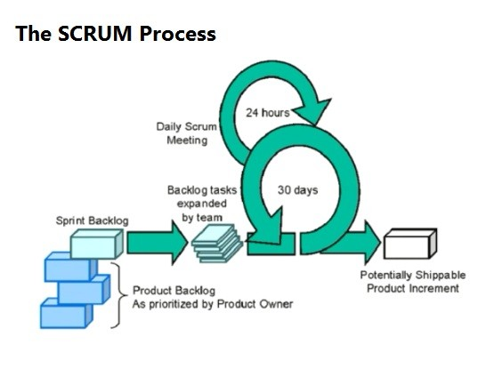
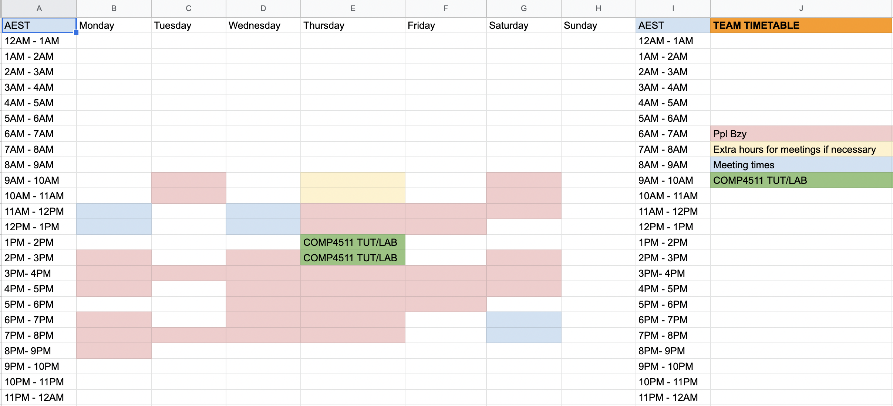

# Meeting Minutes

    Note: 

    Meeting minutes are made in Microsoft Teams Comp4511 group

    The team are recording meeting minutes on GitHub

    
[Link to Teams Group](https://teams.microsoft.com/l/team/19%3aj1kPHvosfma0K4qARaAiX18MXuV6XMTMtnVTYbhTu581%40thread.tacv2/conversations?groupId=b503de66-843a-47ff-b166-41a8f73680e3&tenantId=3ff6cfa4-e715-48db-b8e1-0867b9f9fba3)

[Link to GitHub](https://github.com/Otakuprimchoco/Comp4511_group02.git)

## Tasks

<input type="checkbox" disabled checked /> Confirm team contract and agile process to be used in the project and Github (get emails)

<input type="checkbox" disabled checked /> Make sure meeting minutes for Wed, team contract an agile processes and meeting outline for Sat (Manpreet)

<input type="checkbox" disabled checked /> Make sure everyone discusses their ideas for the project (Everyone)

<input type="checkbox" /> Market research [target audience, pre-questionnaire, questionnaire report]

## Schedule [6pm-8:00pm]
&check; 10 mins : Fomalities

&check; 20 mins : Team contract, assigning roles, agile process and team structure

&check; 30 mins : Ideation Process

&check; 60 mins : Market Research Process

### Members Present:

	• Arya
    • Negin
    • Zihao
	• Manpreet

### The following sections are discussed:

    Agile Process and Work Structure 

    Team Contract, Assigning roles and Rotation roster for meeting minutes

    Group Brainstorming

    Market Research

---
 
# Agile Processes and Work Structure

The team plan to follow the agile process of SCRUM to succeed in the project. 

There are planned to be small daily meetings, which are to be carried out in text on MSTeams, with continuous pair-programming with the team. This was decided, due to the experience of the lead and the comfortability of the team in achieving the project goals with such a process due to previous experience. 

The stand-up meetings are increased, in the number of times in a week, compared to a typical agile process, due to the fact that none of the team members can commit full-time to the project and the time of the project itself.

A timetable was created with 4 major meetings planned out evenly through the week [one including the designated tutorial period]. This was done to ensure consistency throughout the team especially as the team is not able to meet in person and can only do online meetings. 

It also allows the team to complete work hence making use of the mentors’ time as they can ask relevant questions to the Mentor, as well as hold themselves individually and the team itself accountable for their contribution. The team timetable is as follows:

    Note that extra hours are reserved in-case there is a need for further hours of work with the team.

---
# Team Contract, Assigning roles and Rotation roster for meeting minutes

## Team Name: 
    Group02
 
## Team Members and their roles:
The hierarchy is made to split up the responsibility of the project and create a structure to solve problems that may arise in the team and the work, with the mentor being the highest level of authorisation. 

We made an overall lead, the **Project Lead**, to monitor the project as a whole along with the documents/work for submission, and the **Meeting Minutes Officer** to take care of most of the theory. A **GitLab Repository Lead** that monitors the repository of the team and the software decisions. Then a **Issues Board Lead** to monitor the user stories and progress of the team - hence giving a high-quality end result for each part of the project.

For the decision making process we will work as a team to solve any issue however if not possible the hierarchy of the leads will cause Manpreet to take the decision and then if not possible then the mentor (a third party) would have to step in.

###  (Lead (Team Lead and Research Lead))
#### Description:
	• Update everyone through different platforms on due dates, plans and meetings etc
	• Assign roles/tasks
	• Make meetings with everyone
	• Keep up-to-date with everyone
	• If someone is lagging behind help/push them
	• Make sure everything is organised and prepped for each meeting
	• Take meeting notes and keep the meeting going
    • Set up documentation and tasks for submission and records
	• Make sure all tasks are up-to standards for the expectation of criteria and ourselves

### (GitLab Repository Lead (Development lead)) 
#### Description:
	• In-charge of confirming merge requests
	• Keep up-to-date with everyone's code
	• If someone is lagging behind help them or push them
	• Make sure everything is organised in the repository and prepped for each meeting
	• Update Leader/Leads on what is happening

### (Issues Board Lead (Task Lead and Development sub-Lead)) 
#### Description:
	• Assign roles/tasks
	• Keep up-to-date with everyone
	• If someone is lagging behind help them or push them
	• Make sure everything is organised on the board and prepped for each meeting
	• Update Leader/Leads on what is happening
	• Make sure there is an even workload
	• Update board and tasks for changes
	
### (Meeting Minutes Officer (Secretary))
This person will be recording the meeting minutes.

This week Manpreet completed it.

#### This role would involve:
	• Assign roles/tasks
	• Keep up-to-date with everyone and the project timeline
	• Make sure everything is organised and prepped for each meeting
	• Update Leader/Leads on what is happening
	• Make meetings to Report issues and updates with Leader/Leads
	• Write out meeting minutes draft and have it ready to be reviewed by the team
	• Update Timeline of tasks

### (Prototype Lead)
#### This role would involve:
	• Assign roles/tasks
	• Keep up-to-date with everyone and the project timeline
	• Make sure everything is organised and prepped for each meeting
	• Update Leader/Leads on what is happening
	• Make meetings to Report issues and updates with Leader/Leads
	• Determine process of completion and updation of prototypes
	
## Team Contract
The team also signed off on a contract to confirm how the team would work and what their personal commitments to the team were.

Team contract:

[Link to Team Contract](https://docs.google.com/document/d/1lWB6XYmoB3Obf9seRufc-saoLOoQahRF/edit?usp=sharing&ouid=104297194492576027816&rtpof=true&sd=true)

--- 
## Next Meeting
 
--- 
## Personal Tasks for Next Meeting

## Milestone01 Checklist
 
### <input type="checkbox" disabled /> Stage01 
	
&#9744; Questionnaire
	
&#9744; Questionnaire report
	
&#9744; Market research
	
&#9744; journey maps
	
### <input type="checkbox" disabled /> Stage02
	
&#9744; Personas
	
&#9744; Scenarios
	
&#9744; Empathy maps
	
&#9744; Problem Statement

### <input type="checkbox" disabled /> Stage03
	
&#9744; Brainstorm for solutions
	
&#9744; Solution chart
	
&#9744; User stories
	
&#9744; User Story Mapping

