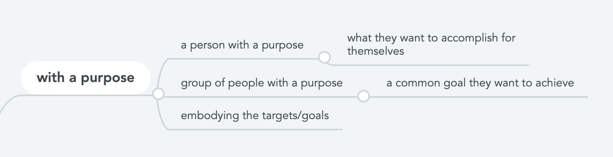
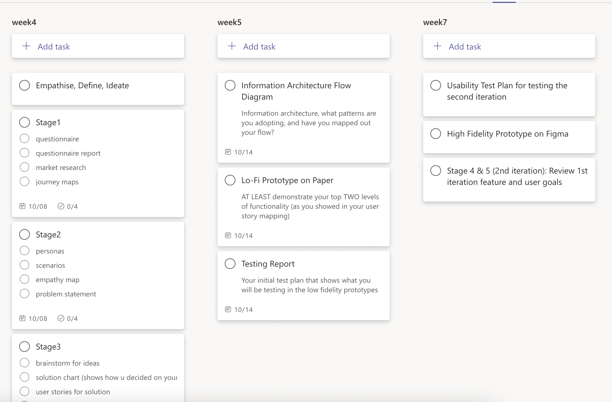
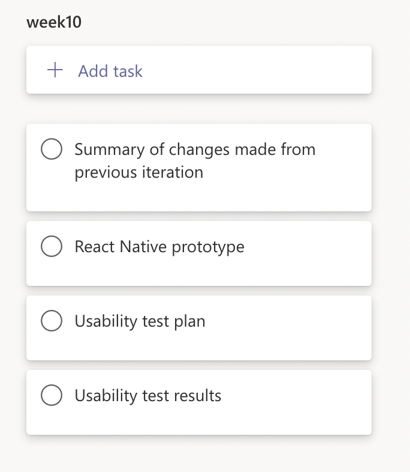
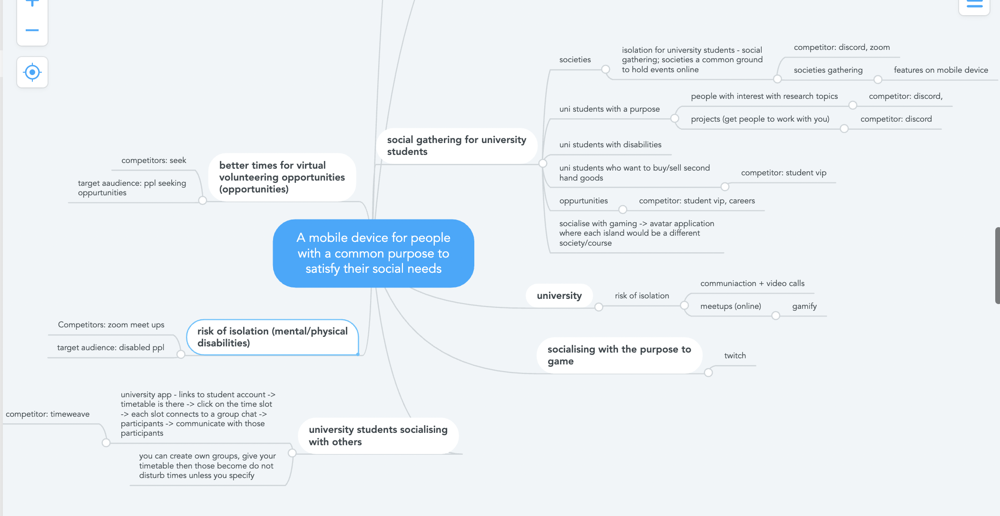

# Meeting Minutes

    Note: 

    Meeting minutes are made in Microsoft Teams Comp4511 group

    The team are recording meeting minutes on GitHub

    
[Link to Teams Group](https://teams.microsoft.com/l/team/19%3aj1kPHvosfma0K4qARaAiX18MXuV6XMTMtnVTYbhTu581%40thread.tacv2/conversations?groupId=b503de66-843a-47ff-b166-41a8f73680e3&tenantId=3ff6cfa4-e715-48db-b8e1-0867b9f9fba3)

[Link to GitHub](https://github.com/Otakuprimchoco/Comp4511_group02.git)

## Schedule [1pm-4pm]

&check; 20 mins : Tutorial + set up of communication

&check; 20 mins : Understanding assignment as a group (key checkpoints)

&check; 140 mins : Group Brainstorming for target area

### Members Present:

	• Arya
    • Negin
    • Zihao
	• Manpreet

### The following sections are discussed:

    Team Information

    Team Timetable 

    Group Brainstorming

----
 
# Team Information

## Team Name: 
 
    Group02
 
## Team Members:

    Manpreet

    Negin

    Zihao

    Arya
----
# Team Timetable
The team had created a timetable before hand, this timetable is to be treated as if it were a part of the university timetable with compulsory attendance, with acknowledgement of a team contract that would be signed at the next meeting.

[Link to Timetable](https://docs.google.com/spreadsheets/d/1VTFsVHnRhYNRIHgmV2rXJYesVVfdKj7II9lT3nbstPY/edit?usp=sharing)

----
# Group Brainstorming
The team first discussed what it means to be with a purpose:

After discussing the specification and the idea in general, the team made a general statement about the specification:

General Statement: 

    "A mobile device for people with a common purpose to satisfy their social needs"

Finished making Task outline:

Then the team brainstormed possible ideas/target audiences to focus on that the spec was outlining to us so that we could market research for a solution.

We agreed on a target audience of "university students at the risk of isolation" for this project

--- 
## Next Meeting

    Confirm team contract and agile process to be used in the project and Github

    Confirm idea

    Finish off draft questionnaire

    Start market research

---  
## Personal Tasks for Next Meeting

    Generate ideas (Everyone)

    Finish meeting minutes for Thurs, team contract an agile processes and meeting outline for Sat (Manpreet)

## Milestone01 Checklist
 
### <input type="checkbox" disabled /> Stage01 
	
&#9744; Questionnaire
	
&#9744; Questionnaire report
	
&#9744; Market research
	
&#9744; journey maps
	
### <input type="checkbox" disabled /> Stage02
	
&#9744; Personas
	
&#9744; Scenarios
	
&#9744; Empathy maps
	
&#9744; Problem Statement

### <input type="checkbox" disabled /> Stage03
	
&#9744; Brainstorm for solutions
	
&#9744; Solution chart
	
&#9744; User stories
	
&#9744; User Story Mapping

